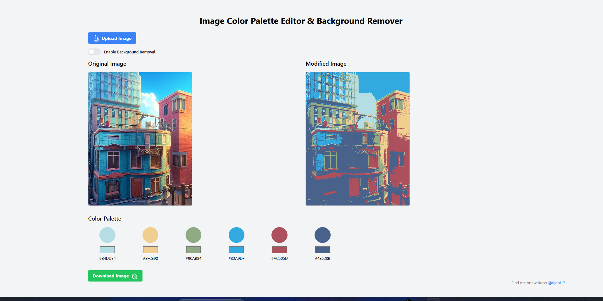

# Image Color Palette Editor with Background Remover

### Overview

This project is an easy-to-use tool that allows you to change the colors of an image and remove its background. Built using **ReactJS**, it provides a clean interface for real-time image editing. 

### Features
- **Background Removal**: Automatically detects and removes the background of an image.
- **Color Palette Editing**: Change the colors of image.
- **Simple UI**: User-friendly interface for image manipulation.

### Demo



### Installation

To get started with the project, follow these steps:

1. Clone the repository:
   ```bash
   git clone https://github.com/eriondibrani/image-recolor.git
   ```

2. Navigate to the project folder:
   ```bash
   cd image-recolor
   ```

3. Install the dependencies:
   ```bash
   npm install
   ```

4. Run the development server:
   ```bash
   npm start
   ```

### Usage

1. Upload an image.
2. Use the color palette editor to change the colors of the image.
3. Enable background removal to remove the background of the image.
4. Download or export the edited image.
  
### Contributing

Contributions are welcome! Feel free to open issues or submit pull requests for improvements and bug fixes.

### License

This project is licensed under the MIT License.
